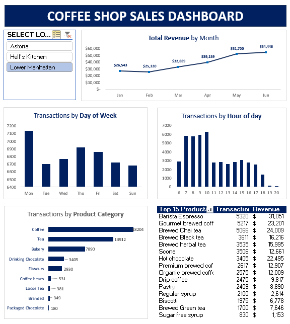
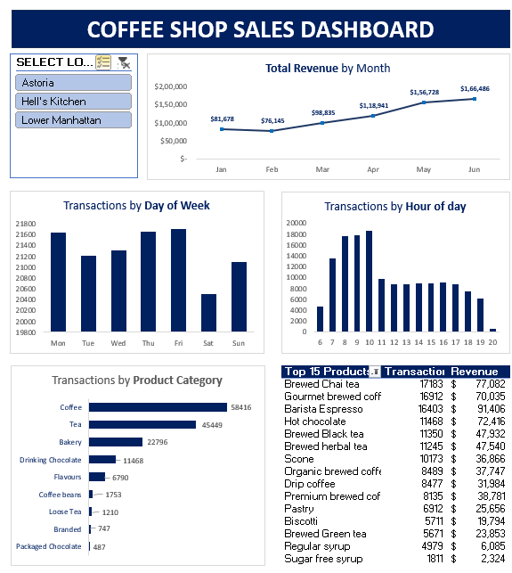
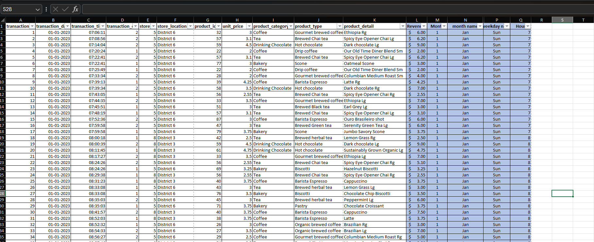

# CoffeeShop_dashboard
A data-driven sales performance dashboard built in Excel.  Analyzing product, location, and seasonal trends using a  fictional-coffee shop dataset.

---

# Project Overview

This Excel dashboard analyzes daily sales transactions for about a year across three locations.

The goal was to:
- Identify sales trends and customer behavior
- Highlight top-performing products and categories
- Deliver business insights and recommendations

- Overall Practice dashboard design and Excel analytics techniques

---

# Tools Used & Skills Applied

- Microsoft Excel
  - Data cleaning & Prep
  - Pivot tables & charts
  - Conditional formatting
  - dynamic dashboards
    
- Data Analysis and Data storytelling
    
---

# Dashboard Snapshots

---
# DataSet Preview

Screenshot of cleaned and structured dataset used:

NOTE: dataset is sourced from Maven Analytics

---

# Key Findings

# Temporal Trends
- Monthly revenue grew steadily, reaching **$166K in June** from **$76K in February**.
- Weekdays (especially Mon & Fri)  saw higher transaction volumes.
- Sundays were consistently the slowest days.

# Hourly Patterns
- Most transactions occurred between 9 AM and 12 PM, confirming morning rush hours are key for sales.
- Sales drop significantly after 4 PM.

# Product & Category Insights
- Top Products:  
  - `Brewed Chai Tea`, `Gourmet Brewed Coffee`, `Barista Espresso`
- Top Categories:  
  - `Coffee`, followed by `Tea` and `Bakery` items
- Bakery products are frequently bought alongside coffee in the mornings.

---

# Business Recommendations

1. Optimize Staff Scheduling
   - Reduce staff during **slow periods** (e.g. Sundays, post-4 PM).
   - Increase headcount during **weekday mornings**, especially **Fridays**.

2. Introduce Combo Deals
   - Offer bundled items like *"Espresso + Pastry"* during peak hours to increase basket size.

3. Promotions in Low Traffic Hours
   - Launch a ** discount** between 3–5 PM to attract afternoon customers.

4.  Marketing by Location
   - Use **location filters** to design promotions based on what sells in each area.

5. Inventory Planning
   - Stock more of high-velocity products during peak periods to avoid missed sales.

---
# What I Learned

- Designing clean, user-friendly dashboards
- Turning data into actionable insights
- Practicing storytelling and professional presentation
- Thinking like a business analyst, not just a data worker
---
# Future Plans

- Recreate this dashboard in a data visualization software (PowerBI or Tableau)
- Build SQL queries for more in-depth analysis

